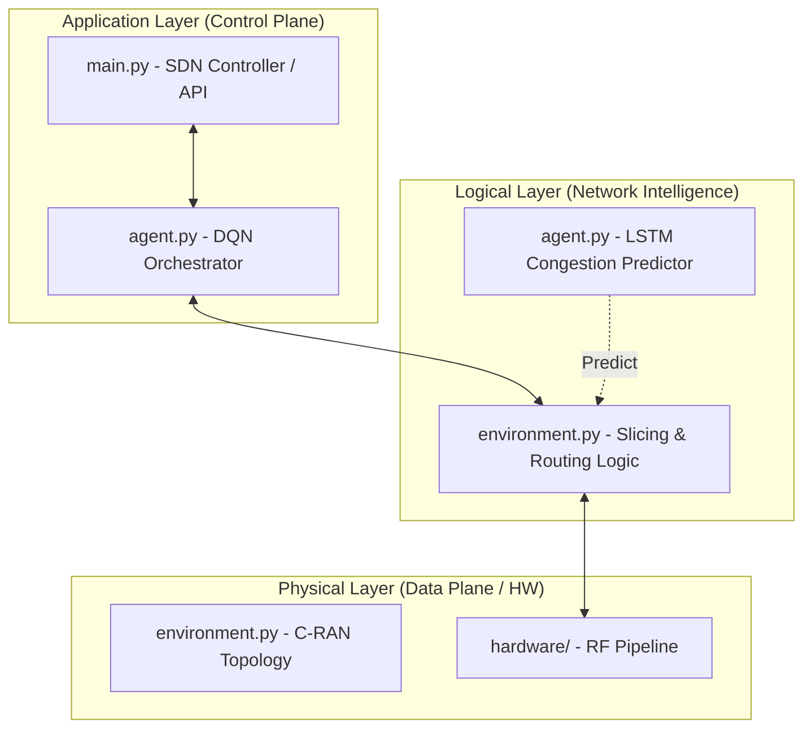

# System Architecture

PCAN-5G is designed as a modular, three-layered platform that aligns with the structural requirements of future wireless networks.

## Layered Design

## 1. Simulation Layer (Data Plane)
*   **Module**: `hardware/`, `environment.py`
*   **Foundation**: *“5G Wireless Communication Systems: Prospects and Challenges”* (Rappaport et al.)
*   **Description**: This layer simulates the physical substrate of the network. It handles Signal propagation, filtering, and hardware-specific impairments (attenuation, phase shift).

## 2. Routing & Allocation Logic (PCAN Intelligence)
*   **Module**: `agent.py`, `backend/baseline_simulator.py`
*   **Foundation**: *“The Role of Machine Learning in Future Wireless Networks”* (Ye et al.)
*   **Description**: The logic core that makes decisions based on current and predicted congestion levels. It implements the cross-layer optimization between network metrics and physical constraints.

## 3. Network Graph Layer
*   **Module**: `environment.py` (NetworkX Implementation)
*   **Foundation**: *“RouteNet: Leveraging Graph Neural Networks for Network Modeling”* (Mestres et al.)
*   **Description**: Represents the actual connectivity of the C-RAN infrastructure. It provides the structured state (topological distance, path hops) that the agent uses to calculate routing costs.

## 4. Control Plane & Orchestration
*   **Module**: `main.py`, `backend/experiment_engine.py`
*   **Foundation**: *“A Survey on Software-Defined Networking”* (Kreutz et al.)
*   **Description**: The entry point for the system. It orchestrates experimental phases and ensures that the separation of concerns between high-level policy (user defined) and low-level mechanics (DQN logic) is maintained.
